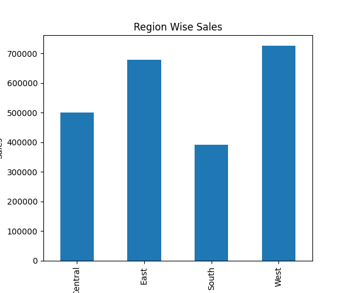
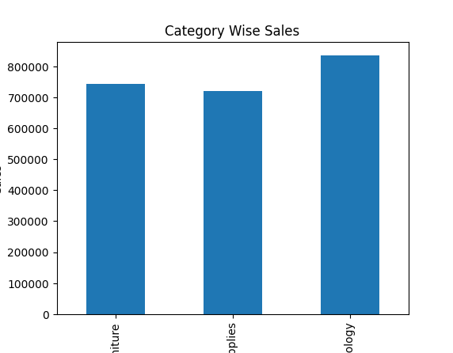
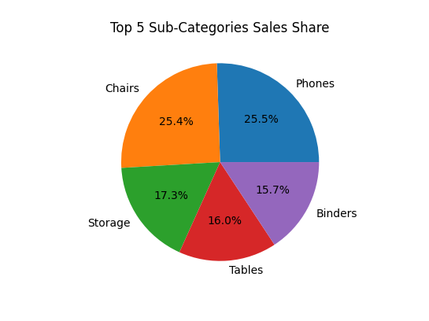
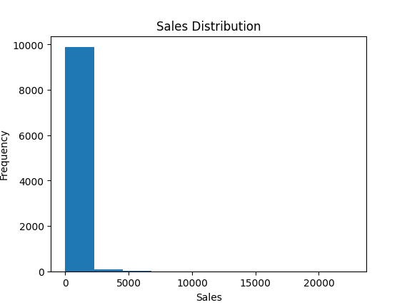

# Sales Performance Analysis Dashboard

## Project Overview
This project analyzes sales performance using Python libraries such as Pandas, NumPy, and Matplotlib. The analysis focuses on regional sales, category performance, profit analysis, and business insights using the Sample Superstore dataset.

---

## Technologies Used
- Python
- Pandas
- NumPy
- Matplotlib


---

## Dataset
- Sample Superstore Dataset
- CSV File Format

---

## Features
- Data Cleaning
- Missing Value Handling
- Duplicate Removal
- Exploratory Data Analysis (EDA)
- Statistical Summary
- Region-wise Sales Analysis
- Category-wise Sales Analysis
- Sub-category Sales & Profit Analysis
- Data Visualization
- Business Insights

---

## Visualizations Included
- Bar Chart for Region-wise Sales
- Bar Chart for Category-wise Sales
- Pie Chart for Top Sub-Categories
- Histogram for Sales Distribution

---

## Business Insights
- West region generated highest sales
- Phones are the best-selling sub-category
- Copiers generated highest profit
- Technology category generated highest revenue

---

## Project Structure

Sales Analysis Project/
│
├── sales_analysis.py
├── sales.csv
├── cleaned_SampleSuperstore.csv
├── README.md
└── screenshots/

---

## Libraries Used

```python
import pandas as pd
import numpy as np
import matplotlib.pyplot as plt
```

---

## How to Run Project

1. Install required libraries

```bash
pip install pandas numpy matplotlib
```

2. Run the Python file

```bash
python sales_analysis.py
```

---

## Output
The project generates:
- Data analysis reports
- Statistical summaries
- Business insights
- Graphical visualizations

---

## Author
Manasa Nalla
## Screenshots

### Region Wise Sales


### Category Wise Sales


### Top Sub-Categories


### Sales Distribution

